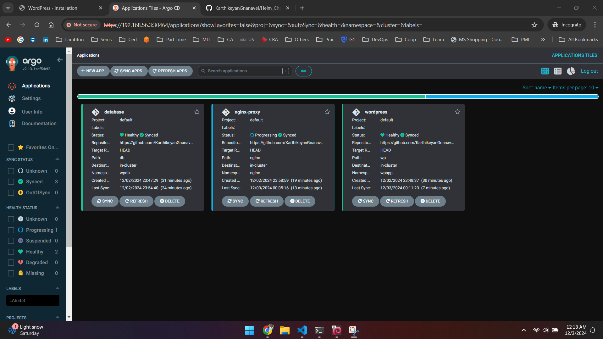
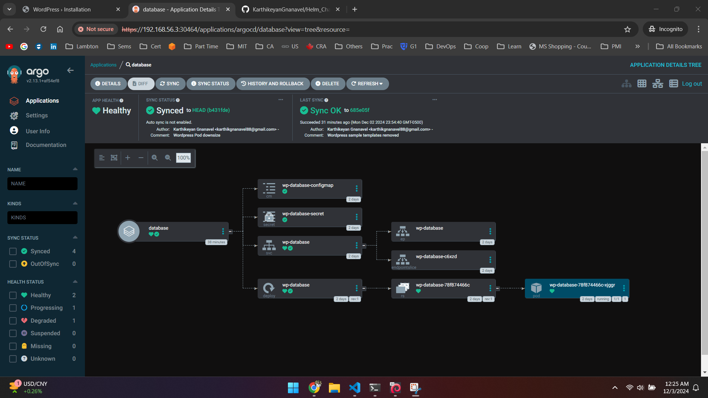
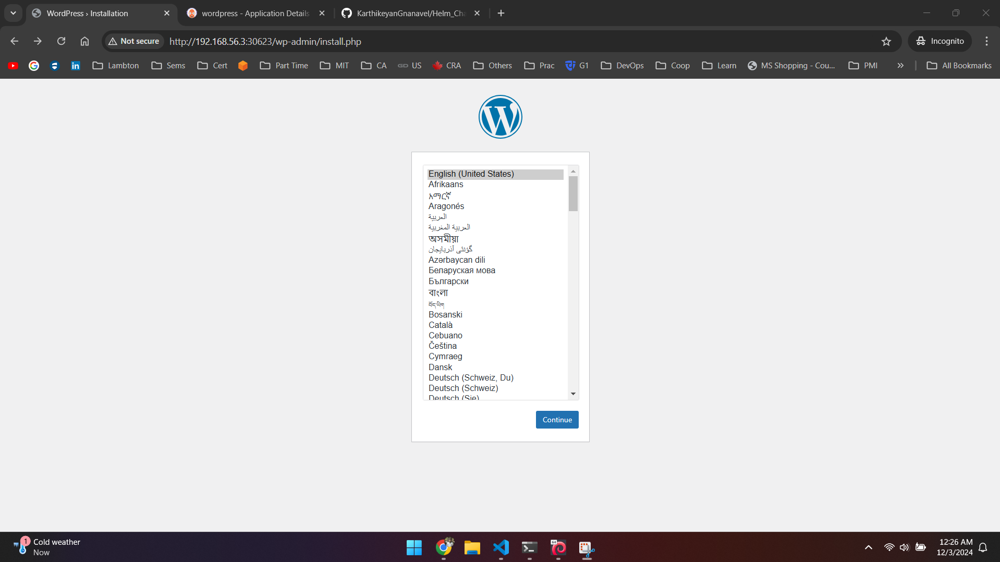
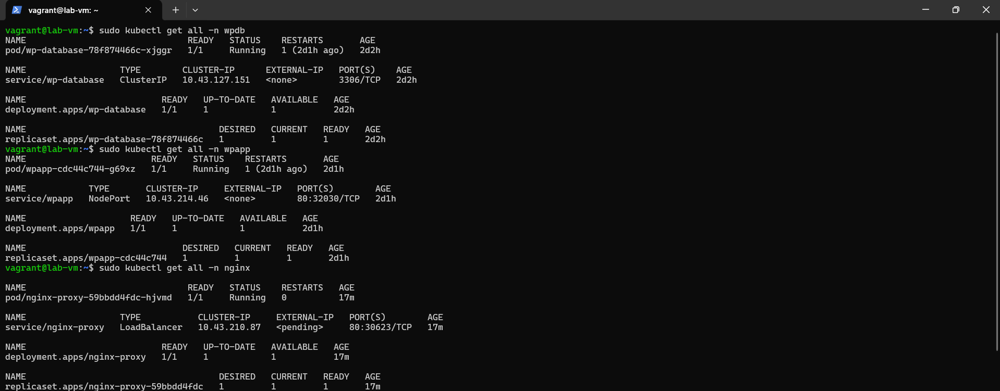
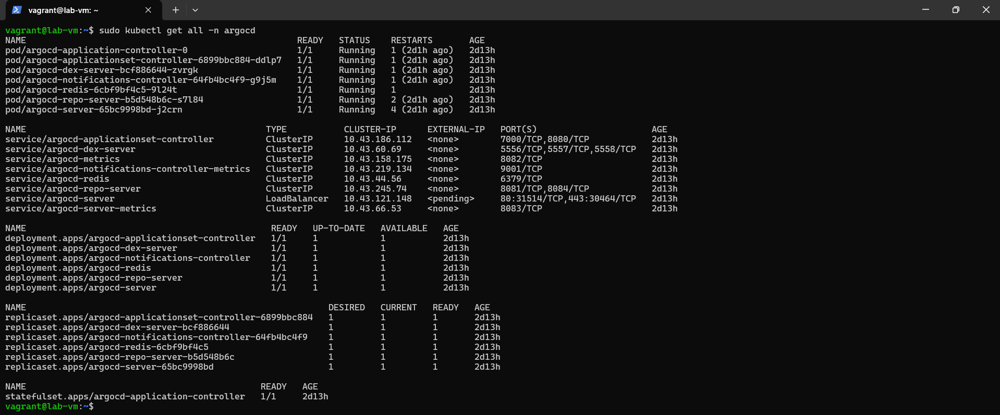

### Helm Commands to Install, Uninstall, List
- To install
```
helm install --dry-run wordpress-db -n wpdb . -f dev/values.yaml
helm install wordpress-db -n wpdb . -f dev/values.yaml -f dev/secrets.yaml --create-namespace
helm ls -n wpdb

helm install wordpress-app -n wpapp . -f dev/values.yaml -f dev/secrets.yaml --create-namespace
helm ls -n wpapp

helm install nginx-proxy ./nginx -n nginx --values nginx/dev/values.yaml --create-namespace
helm ls -n nginx
```

- To upgrade
```
helm upgrade wordpress-db -n wpdb . -f dev/values.yaml -f dev/secrets.yaml
helm upgrade wordpress-app -n wpapp . -f dev/values.yaml -f dev/secrets.yaml
helm upgrade nginx-proxy -n nginx ./nginx --values nginx/dev/values.yaml

```

- To uninstall
```
helm uninstall wordpress-db -n wpdb
helm uninstall wordpress-app -n wpapp
helm uninstall nginx-proxy -n nginx

```

### Generate the manifests:
`helm template -g --output-dir ./ymls . -f stage/values.yaml -f stage/secrets.yaml`

### DB Connection issue
- the volume is used for db container is hostpath. if db is configured incorrectly, the miss-configured db files will be stored in the volume. Untill the volume is cleared, you will get db issue

- check the env variables

## Results of the ArgoCD Implementation

### ArgoCD UI for Application of WordPress Stack


### ArgoCD UI for MariaDB Database App


### ArgoCD UI for Wordpress App


### ArgoCD UI for Nginx-Proxy Server App


### Successful Installation of Running Wordpress App in K8s Cluster using Helm and ArgoCD


### K8s Resources for Wordpress Stack


### K8s Resources for ArgoCD App



## Install helm
- On Mac
```
brew install helm
```

- On Windows via choco
```
choco install kubernetes-helm
```

- On Windows manual installation:
Go to the Helm GitHub releases page.

Download the latest Windows .zip file, e.g., helm-v3.x.x-windows-amd64.zip.

Extract the file to a directory of your choice.

Add the extracted folder to your system PATH  and open powershell and try `helm version` command


- On Debian/Ubuntu
```
curl https://baltocdn.com/helm/signing.asc | gpg --dearmor | sudo tee /usr/share/keyrings/helm.gpg > /dev/null
sudo apt-get install apt-transport-https --yes
echo "deb [arch=$(dpkg --print-architecture) signed-by=/usr/share/keyrings/helm.gpg] https://baltocdn.com/helm/stable/debian/ all main" | sudo tee /etc/apt/sources.list.d/helm-stable-debian.list
sudo apt-get update
sudo apt-get install helm
```

- On Linux
```
sudo dnf install helm
```


## Install argoCD on K3s clusters

kubectl create namespace argocd

wget https://raw.githubusercontent.com/argoproj/argo-cd/stable/manifests/install.yaml -O /tmp/install.yaml

kubectl apply -n argocd -f /tmp/install.yaml

kubectl get all -n argocd

**Note**: you may get image pull error on College network. Switch to mobile network
```
Failed to pull image "redis:7.0.14-alpine": failed to pull and unpack image "docker.io/library/redis:7.0.14-alpine": failed to copy: httpReadSeeker: failed open: failed to do request: Get "https://registry-1.docker.io/v2/library/redis/manifests/sha256:45de526e9fbc1a4b183957ab93a448294181fae10ced9184fc6efe9956ca0ccc": net/http: TLS handshake timeout
```

kubectl -n argocd get secret argocd-initial-admin-secret -o jsonpath="{.data.password}" | base64 -d

kubectl port-forward service/argocd-server 8081:80 -n argocd


## Install client
brew install argocd

or

curl -sSL -o argocd-linux-amd64 https://github.com/argoproj/argo-cd/releases/latest/download/argocd-linux-amd64
sudo install -m 555 argocd-linux-amd64 /usr/local/bin/argocd
rm argocd-linux-amd64

## Update admin password
- To change the password, edit the argocd-secret secret and update the admin.password field with a new bcrypt hash.
```
argocd account bcrypt --password admin123
$2a$10$.9B0duiZedE0pTk5FZS8muFIs/asUPDjliTCiX./MOKOwYMXhQ43C
```

```
kubectl -n argocd patch secret argocd-secret \
-p '{"stringData": {
"admin.password": "$2a$10$.9B0duiZedE0pTk5FZS8muFIs/asUPDjliTCiX./MOKOwYMXhQ43C",
"admin.passwordMtime": "'$(date +%FT%T%Z)'"
}}'
```

## Disable pass for Admin
Add `admin.enabled: "false"` to the `argocd-cm` ConfigMap


